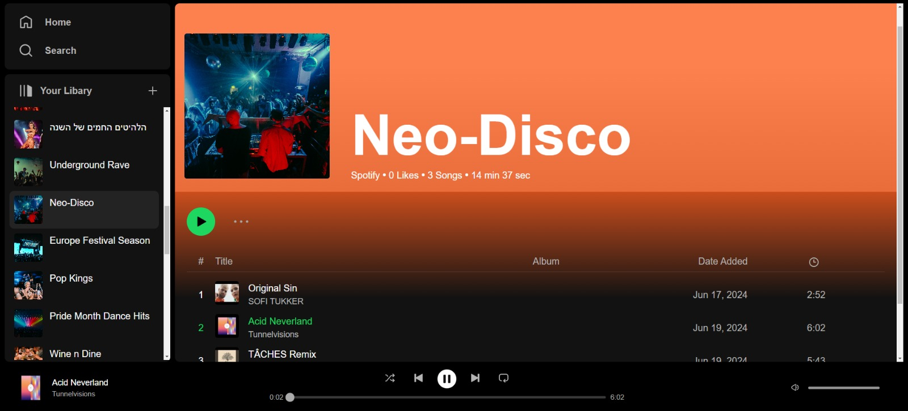

# Rythmix

Rythmix is a web application based on Spotify that allows users to access music, create and share playlists, and manage their music preferences. The app utilizes the YouTube Data API for accessing music content and features a React frontend with a Node.js backend. Data is stored using MongoDB Atlas.

## Features

- **Music Access**: Utilize the YouTube Data API to search and play music.
- **Playlists**: Create, manage, and share playlists.
- **Database**: Store user data and playlists in MongoDB Atlas.
- **User Authentication**

## Technologies Used

- **Frontend**: React, Redux, Axios, Sass
- **Backend**: Node.js, Express
- **Database**: MongoDB Atlas
- **API**: YouTube Data API v3

## Libaries

- **API**: YouTube Data API v3
- **Player**: react-player
- *MUI*: 
- *extract-colors*: 

## Prerequisites

- Node.js (v12.x or later)
- MongoDB Atlas account
- YouTube Data API key

## Project Structure

- **client**: Contains the React frontend
  - **src**
    - **components**: React components
    - **redux**: Redux actions and reducers
    - **services**: API services
    - **styles**: CSS files
    - **App.js**: Main App component
    - **index.js**: Entry point

- **server**: Contains the Node.js backend
  - **controllers**: Request handlers
  - **routes**: Express routes
  - **middlewares**: Custom middlewares
  - **app.js**: Express app setup
  - **server.js**: Server entry point